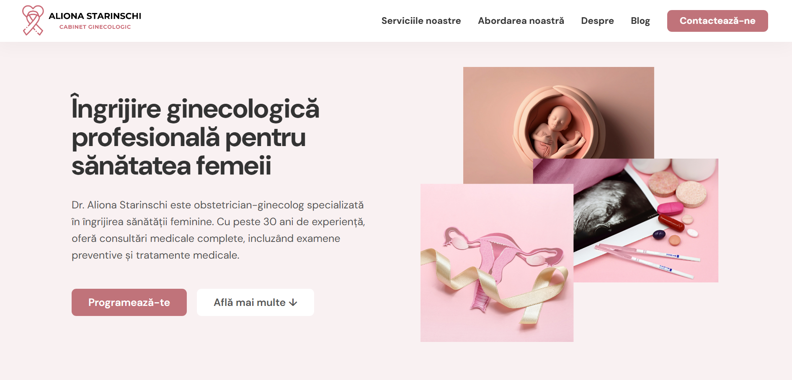
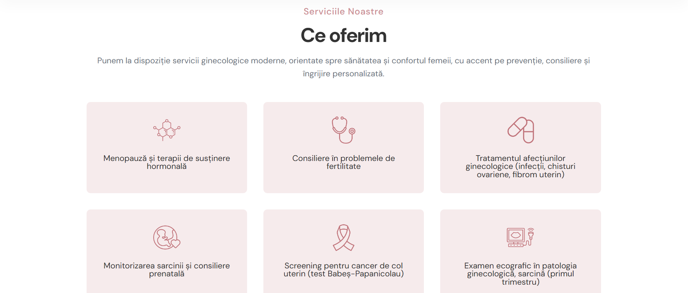
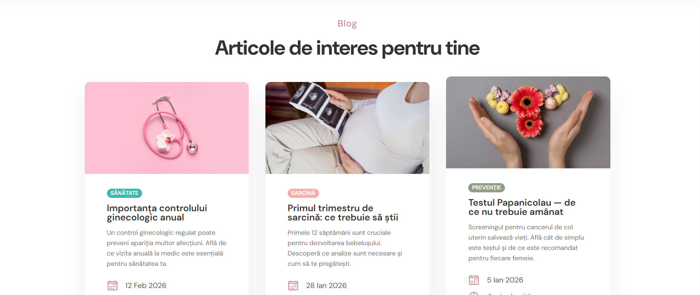
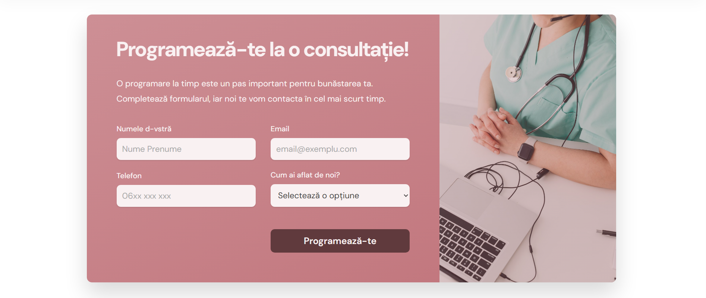
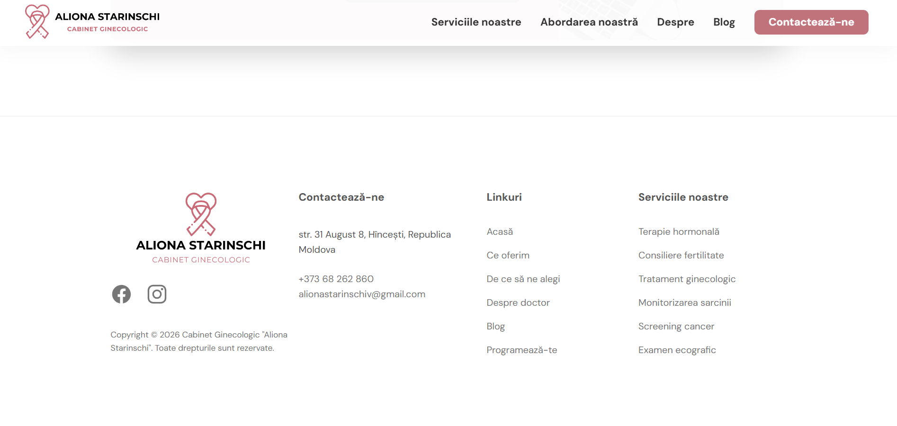

# Cabinet de Ginecologie – Dr. Aliona Starinschi

A landing page for a gynecology medical practice based in Hincești, Republic of Moldova. The website presents the services, expertise, and professional background of Dr. Aliona Starinschi, offering patients an easy way to learn about the clinic and schedule an appointment.

## About the Project

This is a single-page responsive website built with **HTML** and **CSS** as part of a web development university course. The page features a clean, modern design with a soft color palette centered around medical professionalism and patient trust.

### Sections

- **Hero** — Introduction with a call-to-action for booking appointments
- **Serviciile noastre** — Overview of gynecological services offered (hormonal therapy, fertility counseling, prenatal care, ultrasound, etc.)
- **De ce să ne alegi** — Key reasons to choose the clinic, with a gallery of images
- **Despre doctor** — Professional background and conference participation of Dr. Starinschi
- **Blog** — Featured articles on women's health topics
- **Programează-te (CTA)** — Appointment booking form with gradient background
- **Footer** — Contact info, navigation links, services list, social media, and embedded Google Maps

### Built With

- HTML5
- CSS3 (Flexbox, Grid)
- Google Fonts (DM Sans)
- Ionicons

## Live Demo

[Live Demo](https://patriciamoraru.github.io/tum-web-lab2/)

## Screenshots

### Hero
The main landing section with a headline, a short description of the clinic, and two call-to-action buttons. Accompanied by an image collage on the right.

### Serviciile noastre
A 3-column grid showcasing the six core gynecological services offered, each with a custom icon and description.

### De ce să ne alegi
A split layout with a photo gallery on the left and a text section on the right highlighting the clinic's patient-centered approach, ending with a link to the appointment form.

### Despre doctor
Introduces Dr. Aliona Starinschi with her professional experience, areas of expertise, and conference participation, alongside a portrait photo.

### Blog
Three article cards on women's health topics, each with an image, tag, title, short description, date, and reading time.

### Programează-te (CTA)
An appointment booking form with a gradient background and a background image of a doctor. Includes fields for name, email, phone, and a referral source dropdown.

### Footer
A four-column footer with the clinic logo, contact information, navigation links, and a list of services. Includes social media icons and a copyright notice.

